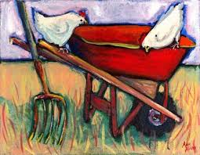
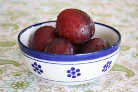

# William Carlos Williams

## The Red Wheelbarrow

> so much depends  
> upon  
>   
> a red wheel  
> barrow  
>   
> glazed with rain  
> water  
>   
> beside the white  
> chickens.  

## This Is Just To Say

> I have eaten  
> the plums   
> that were in  
> the icebox  
>   
> and which  
> you were probably  
> saving  
> for breakfast  
>   
> Forgive me  
> they were delicious  
> so sweet  
> and so cold  
 
