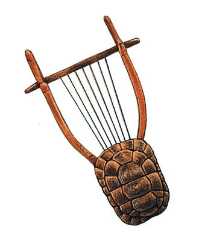

# Sappho

## fragment 3, translated by Julia Dubnoff

> Now, I shall sing these songs  
> Beautifully  
> for my companions.  

## Fragment 118

> Sing, my sacred tortoiseshell lyre  
> come, let my words  
> accompany your voice  

