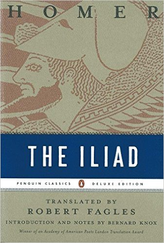

# Iliad

> There is no place where one really feels at home anymore.   
> 
> So, the thing that one longs to get back to, before anything else,  
>  
> is whatever place there may be where one could feel at home,   
> 
> and that is because it is in that place - and in that place alone -   
>   
> 
> where one would really like to feel at home.   
> 
> That place is the world of the **Greeks**.  
> 
>    --Friedrich Nietzsche, *The Will to Power: Attempt at a Revaluation of All Values* (1885)  

## Resources 

### English Translations and Audiobooks

#### Translated by Ian Johnson {#Johnson-Iliad}

  

In [Ian Johnson][1], *free*

The audio version by [Anton Lesser][2] is in [Naxos Audiobooks][3].

This version is not as popular as the big three in Section \@ref(Fagles-Iliad). I put it on top because this is the most accessible *Iliad* I have even read and it's FREE. Another bonus is the high quality unabridged audiobook.

#### Translated by Samuel Butler, Revised by Gregory Nagy et al. {#Nagy-Iliad}

In [Center For Hellenic Studies](http://chs.harvard.edu/CHS/article/display/5286), *free*

The only prose translation in this list. Used in a MOOC course of \@ref(Nagy-H24H-Iliad).

One of the revisers [Gregory Nagy](http://chs.harvard.edu/CHS/article/display/1234) said this revised translation aims to be as honest as possible to the original Greek text. 

#### Translated by [Robert Fagles](https://www.wikiwand.com/en/Robert_Fagles) {#Fagles-Iliad}

   

In [Amazon](https://www.amazon.com/gp/product/0140275363/). This is arguably the best translation in the market considering the [tradeoff of rigorousness and readability](https://oldbooksblog.wordpress.com/2010/10/18/best-translation-iliad/). It's also the only print version I hold.

The [corresponding audiobook](http://www.audible.com/pd/Classics/The-Iliad-Audiobook/B002V5D8LU/) is abridged, unfortunately. This is the only drawback I think of using this version (not the version itself).

Traditionally the other two strong competitive translations are [Richmond Lattimore](https://www.amazon.com/Iliad-Homer/dp/0226470490/) and [Robert Fitzgerald](https://www.amazon.com/Iliad-Homer/dp/0374529051/). These two versions both have nice unabridged audiobooks:

 
 
   
  

#### Translated by [Caroline Alexander](https://www.wikiwand.com/en/Caroline_Alexander_(author)) {#Caroline-Iliad}

   

In [Amazon](https://www.amazon.com/Iliad-New-Translation-Caroline-Alexander/dp/0062046284/). 

There are dozens of modern translations of *Iliad* and the reason I single this new translation out is solely because, this is the very first female translation of Homer around the world! Currently I only read a fraction of her translation from one of her other books, [*The War That Killed Achilles*](https://www.amazon.com/War-That-Killed-Achilles-Homers/dp/0143118269/).

### Video Courses

#### The Ancient Greek Hero in 24 Hours (Hour 1-8 ) {#Nagy-H24H-Iliad}

   

In [edX](https://courses.edx.org/courses/course-v1%3AHarvardX%2BHUM2x%2B2T2016/info), taught by [Gregory Nagy](http://chs.harvard.edu/CHS/article/display/1234) of Harvard University. 

Use text in Section \@ref(Nagy-Iliad). The accompany book for this course is, *The Ancient Greek Hero in 24 Hours* by the instructor which is also free [online](http://chs.harvard.edu/CHS/article/display/5971).

Homeric Iliad  
Homeric Odyssey  
The Epic Cycle  
Hesiodic Theogony  
Hesiodic Works and Days  
Herodotus’ Histories  
Homeric Hymn  
Alcman’s Partheneion  
The Poetry of Sappho  
Aeschylus’ Agamemnon  
Aeschylus’ Libation Bearers  
Aeschylus’ Eumenides  
Sophocles’ Oedipus at Colonus  
Sophocles’ Oedipus Tyrannos  
Euripides’ Hippolytus  
Euripides’ Bacchae  
Plato’s The Apology of Socrates  
Plato’s Phaedo  
Pausanias  
Theognis of Megara  
Pindar’s Pythian  
Selections from Aristotle  

#### Greeks at War: Homer at Troy

In [edX](https://courses.edx.org/courses/course-v1%3AColgateX%2BGW101x%2B3T2015/info), taught by [Robert Garland](http://www.colgate.edu/facultysearch/facultydirectory/rgarland) of Colgate University. 

## Book I (1)

### Who's will

### Gods intervene, metaphorically

Gods even fights with immortals physically. but  
Apollo, Pallas Athena  --  metaphorically

### Achilles is a good leader, BUT

Achilles to mom: I'm the first  ..  so far so good...  

Agamemnon: ironic care

### Achilles and Muhammad Ali

## Book II (2)

[1]: https://records.viu.ca/~johnstoi/homer/iliad_title.htm
[2]: https://www.wikiwand.com/en/Anton_Lesser
[3]: http://www.naxosaudiobooks.com/iliad-the-unabridged

