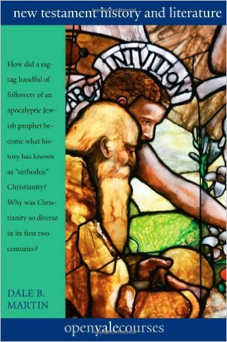

# New Testament

## Resources

### Study Bible (English)

#### The New Oxford Annotated Bible with Apocrypha: New Revised Standard Version, 4th Edition

  

In [Amazon](https://www.amazon.com/New-Oxford-Annotated-Bible-Apocrypha/dp/0195289609). 

#### The Restored New Testament: A New Translation with Commentary, Including the Gnostic Gospels Thomas, Mary, and Judas 

  

In [Amazon](https://www.amazon.com/Restored-New-Testament-Translation-Commentary/dp/039306493X). 

### Introductory

#### The New Testament: A Historical Introduction to the Early Christian Writings {#Ehrman-NT}

  

In [Amazon](https://www.amazon.com/New-Testament-Historical-Introduction-Christian/dp/019020382X). 

Used in course \@ref(Martin-NT).

### Early Christian writings

[Early Christian writings](http://www.earlychristianwritings.com/)

### Video Courses

#### Introduction to the New Testament History and Literature {#Martin-NT}

In [Open Yale Courses](http://oyc.yale.edu/religious-studies/rlst-152), taught by [Dale B. Martin](http://religiousstudies.yale.edu/people/dale-martin) of Yale University. 

Use \@ref(Ehrman-NT) as textbook. The course contents also went to a book, [*New Testament History and Literature*](https://www.amazon.com/Testament-History-Literature-Open-Courses/dp/0300180853/)

  

#### Early Christianity: The Letters of Paul

In [edX](https://courses.edx.org/courses/HarvardX%2FHDS1544.1x%2F2013_SOND/info), taught by [Laura Nasrallah](http://hds.harvard.edu/people/laura-s-nasrallah) of Harvard University. 

####  Jesus in Scripture and Tradition

In [edX](https://courses.edx.org/courses/NotreDameX%2FTH120.1x%2F2T2015/info), taught by [Gary Anderson](http://theology.nd.edu/people/faculty/gary-anderson/) of University of Notre Dame. 

This course does not focus on the modern Bible scholarship; rather, it offers a seminary way to read Bible. Nice to have second view.
