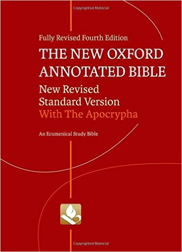
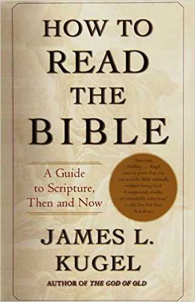

# Hebrew Bible

## Resources

### Study Bible (English)

#### The New Oxford Annotated Bible with Apocrypha: New Revised Standard Version, 4th Edition

  

In [Amazon](https://www.amazon.com/New-Oxford-Annotated-Bible-Apocrypha/dp/0195289609). 

#### The Jewish Study Bible: 2nd Edition

  

In [Amazon](https://www.amazon.com/Jewish-Study-Bible-Second/dp/0199978468). 

### Introductory

#### How to Read the Bible: A Guide to Scripture, Then and Now {#Kugel-Bible}

  

In [Amazon](https://www.amazon.com/How-Read-Bible-Guide-Scripture/dp/0743235878). 

Used in course \@ref(Cohen-Bible).

### Video Courses

#### The Hebrew Bible {#Cohen-Bible}

In [Biblical Archaeology Society](http://courses.biblicalarchaeology.org/hebrewbible/), or [iTunes](https://itunes.apple.com/us/course/the-hebrew-bible/id819616149), taught by [Shaye J.D. Cohen](http://studyofreligion.fas.harvard.edu/people/shaye-jd-cohen) of Harvard University. 

Use \@ref(Kugel-Bible) as textbook.

#### The Hebrew Scriptures in Judaism and Christianity

In [iTunes](https://itunes.apple.com/us/course/hebrew-scriptures-in-judaism/id512201207), taught by [Shaye J.D. Cohen](http://studyofreligion.fas.harvard.edu/people/shaye-jd-cohen) of Harvard University. 

#### Introduction to the Old Testament (Hebrew Bible)

In [Open Yale Courses](http://oyc.yale.edu/religious-studies/rlst-145), taught by [Christine Hayes](http://religiousstudies.yale.edu/people/christine-hayes) of Yale University. 

The course contents also went to a book, [*Introduction to the Bible*](https://www.amazon.com/Introduction-Bible-Open-Yale-Courses/dp/0300181795/)

  

#### The Bible's Prehistory, Purpose, and Political Future

In [Coursera](https://www.coursera.org/learn/bible-history/home/welcome), taught by [Jacob L. Wright](http://candler.emory.edu/faculty/profiles/wright-jacob.html) of Emory University. 

